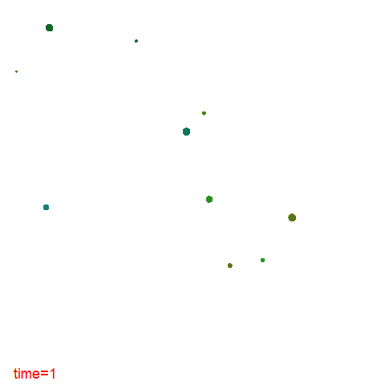
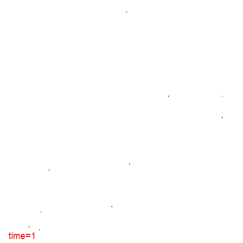

```{r motivation for the model, include=FALSE}
knitr::opts_chunk$set(echo = TRUE)
```

# Report on simulation of a forest of growing trees

## Motivation for the model extensions

The motivation for this simulation was a question that is relevant in the fields of Carbon Farming and landscape conservation: how long would it take for a initial stand of trees to reach a target density value?
Carbon farming projects that focus on vegetation methods often have specific tree densities they need to achieve [@CERGuide] [@CERAvoidedClearing]. In addition, from a landscape conservation perspective, a forest with more than 20 per cent canopy covers is considered to be a woodland forest [@AustraliaSOF2018] and may have more specific managements requirements and legislative protections [@QLDEucalyptWoodlands].
In addition to the main question, secondary questions were:

* If the initial stand is planted in rows, does that affect the timing of reaching the desired density?
* If the initial stand is of an even age, does that affect the timing of reaching the desired density?
* Is the model reasonable in simulating at a small (1ha) and large (25ha) scale?
* Since a key management action in certain forests is weed control to support survival of young trees, does improving survival rate by 10% affect the timing of achieving the desired density significantly?

A concise literature review was carried out on key aspects of eucalyptus biology and ecology to better establish the parameters of the model. The research identified relevant studies in the field of plant growth rate, and survival rate [@Ngugi2015] and [@Tian2020] as well as dispersal [@Booth2017].  

## Description of my model

The provided individual-based model of tree growth in a forest was a great start and already included some important concepts. However, the models lacked in some elements that would make the model more realistic. In addition, for the model to be feasible given th task, some assumptions had to be made:

1. The forest is in Australia and mostly composed of trees from eucalyptus trees (from species with similar characteristics).
2. No fire events occurred during the time period.
3. 20 per cent canopy cover is achieved with a number of trees between 150 and 200 trees per hectare.

The model was designed to take an initial forest with a certain number of trees in designated XY location and with variables age, radius (derived from diameter at breast height), status of the tree (as in dead or alive) and how long a tree was dead for. In each time step, the model included tree groth in size, aging, potential reproduction, potential death and falling of dead trees. 

Below figure 1 helps understand key elements in the model:

{width=70%}

Each tree has the following variables associated with it: 

* ID – unique identified for each tree
* Alive – condition of the tree in terms of dead or alive (if tree is alive this variable is TRUE)
* x – coordinate x for the tree location in the forest
* y – coordinate y for the tree location in the forest
* r – radius of a tree in centimetres, derived from the diameter at chest hight
* a – age of the tree. (estimate for the initial forest based on radius and mean growth rate, and then calculated in terms of time steps)
* d - number of time steps since a tree has died

The parameters used in the modelling of the forest through time are:
* maxTRees – the maximum number of trees the forest/model handles
* maxx – the maximum size of the forest in terms of x coordinate
* maxy - the maximum size of the forest in terms of y coordinate
* maxr – the maximum radius that each tree could get
* maturityr – the radius when a plant reaches maturity for reproduction
* gamma_max – top of the range for the growth rate per time step
* gamma_min – bottom of the range for growth rate per time step
* mu - mortality probability per time step for trees over 3 years
* mu_under_3 – mortality probability for plants under 3 years
* lambda - probability of producing surviving offspring after reaching maturity, per time step
* d_d – maximum dispersal distance
* min_d - minimum distance between trees
* d_f - number of time steps it takes for a dead tree to "fall"and the space be open for other trees

Two key elements of the model are the distinct mortality rates for young trees (a>3) and the placement of new trees in the available space within the maximum dispersal distance from the parent tree. The model attempted to place the new tree in the available space 50 times and if that was not possible, the tree was then considered dead.

The figures below illustrate this spacial element fo the model.

{width=50%}


{width=50%}

Three different types of initial forests were used:
* Initial stand of 10 trees randomly placed and with random age and radius.
* Initial stand of 10 trees planted in 2 rows, with even age and radius.
* Initial stand of 10 trees planted randomly in the space but with even age and radius.

In addition, a test of the scalability of the model was carried out. For that, an area of 25 hectares was selected with an initial stand of 250 trees (10 per hectare).

## The code

Below is the code used for the simulation of an initial stand of 10 trees, randomly placed in 1 hectare and with randomly selected radius and age.

```{r code, echo=TRUE, message=FALSE, warning=FALSE}
# Simple simulation of a forest of growing trees_modification on t_steps and maximnum number of trees
# Authors: Barbara Oliveira De Loreto adapted from Jan Engelstaedter & Daniel Ortiz-Barrientos
# Date: 01/05/2021

library(animation)
library(plotrix)
library(ggplot2)
library(dplyr)
library(purrr)
library(tidyr)

# establish tmax and the initial number of trees
tmax <- 70 # number of time steps to simulate
nini <- 10  # initial number of trees

# establish the list of parameters
p <- list()
p$maxTrees <- 10^5      # number of trees (alive or dead) that the simulation can handle
p$maxx <- 100           # x-size of forest in meters (equals a hectare)
p$maxy <- 100           # y-size of forest in meter
p$maturityr <- 0.3      #size which marks the maturity for a tree - seed production
p$maxr   <- 1           # maximum radius of a tree
p$gamma_max  <- 0.1     # growth per time step max
p$gamma_min <- 0.01     #growth per step min
p$mu     <- 0.02        # mortality probability per time step
p$mu_under_3 <- 0.2     # mortality probability for plants under 3 years
p$lambda <- 0.2         # probability of producing surviving offspring after reaching maturity, per time step
p$d_d <- 30             # dispersal maximum distance
p$min_d <- 4            #minimum distance from an existing tree for new seedlings to start
p$d_f <- 3              #number of time steps it takes for a dead tree to "fall"and the space be open for other trees


# establish a dataframe with the initial forest

# initial random forest: 
iniForest <- data.frame(ID    = 1:nini,                             # ID for each tree 
                        alive = TRUE,                               # living or dead?
                        x     = runif(nini, min = 0, max = p$maxx), # x position
                        y     = runif(nini, min = 0, max = p$maxy), # y position
                        r     = runif(nini, min = 0, max = p$maxr), # radius
                        a     = NA,                                 # age
                        d     = NA)                                 # how long tree has been dead

# expected age based on their size using mean o gamma_mx and gamma_min
iniForest$a <- iniForest$r/((p$gamma_max + p$gamma_min)/2) 
iniForest$d <- 0 # all trees are alive so no trees are dead


# core simulation function:

simulateForest <- function(iniForest, tmax, p) {
  ftt <- as.vector(rep(NA, tmax + 1), "list") # "forest through time"
  ftt[[1]] <- iniForest #copy initial forest into first space
  nextID <- max(ftt[[1]]$ID, na.rm = TRUE) + 1 #establish next ID based on the exciting ones
  for(i in 1:tmax) {
    ftt[[i + 1]] <- data.frame(ID = rep(NA, p$maxTrees), alive = NA,                 
                               x = NA, y = NA, r = NA, a = NA, d= 0)  # initiate the object with NAs, size is max number of trees                
    
    # forest in new time step copied over from previous one:
    ftt[[i + 1]][1:nrow(ftt[[i]]),] <- ftt[[i]]
    
    # indices of living trees:
    alive <- which(ftt[[i + 1]]$alive)
    
    # aging all trees:
    ftt[[i + 1]]$a[alive] <- ftt[[i + 1]]$a[alive] + 1
    
    # growing trees:
    canGrow <- which(ftt[[i + 1]]$alive & ftt[[i + 1]]$r < p$maxr)
    ftt[[i + 1]]$r[canGrow] <- ftt[[i + 1]]$r[canGrow] + runif(1, max = p$gamma_max, min = p$gamma_min)  #growth based on a random number from a range
    
    # make sure they're not growing beyond maxr:
    ftt[[i + 1]]$r[ftt[[i + 1]]$r > p$maxr] <- p$maxr
    
    # death dynamics
    # death under 3 years
    alive_under_3 <- which(ftt[[i + 1]]$alive & ftt[[i + 1]]$a <=3)
    ftt[[i + 1]]$alive[alive_under_3] <- (runif(length(alive_under_3)) > p$mu_under_3)
    
    # death others:
    alive_over_3 <- which(ftt[[i + 1]]$alive & ftt[[i + 1]]$a >3)
    ftt[[i + 1]]$alive[alive_over_3] <- (runif(length(alive_over_3)) > p$mu)
    
    # time steps a tree has been dead
    dead <- which(!ftt[[i + 1]]$alive) #establishing an index of dead ones
    ftt[[i + 1]]$d[dead] <- ftt[[i + 1]]$d[dead] + 1
    
        # Updating the forest state, removing dead trees 
    dead_falls <- which(ftt[[i + 1]]$d > p$d_f) #establishing an index of trees to be removed
    
    if (length(dead_falls) > 0) {ftt[[i + 1]] <-ftt[[i + 1]][-dead_falls,] #removing dead trees that have been there for some steps
    # re-establish the same amount of NA spaces
    add_NA <- data.frame(ID = rep(NA, length(dead_falls)), alive = NA,                 
                         x = NA, y = NA, r = NA, a = NA, d= 0) 
    ftt[[i + 1]] <- rbind(ftt[[i + 1]], add_NA) #bind empty entries
    }
    
    #reestablishing alive index after trees died
    alive <- which(ftt[[i + 1]]$alive) 
    
    # reproduction:
    for(j in alive) {
      if ((ftt[[i + 1]]$r[j]>= p$maturityr) && (runif(1) < p$lambda)){  # if r is at maturity or larger, reproduction happening?
        emptySlot <- which(is.na(ftt[[i + 1]]$ID))[1] # next empty row in dataframe
        ftt[[i + 1]]$ID[emptySlot] <- nextID
        ftt[[i + 1]]$alive[emptySlot] <- TRUE
        ftt[[i + 1]]$r[emptySlot] <- 0
        ftt[[i + 1]]$a[emptySlot] <- 0
        
        ## setting up check of space available
        attempt <- 0
        max_attempts <- 50 #maximum number of placement attempts
        
        #check if a new tree position overlaps with existing trees
        is_space_available <- function(new_x, new_y, exiting_trees, min_d) {
          min_d <- p$min_d
          existing_trees <- na.omit(ftt[[i + 1]])
          distances <- sqrt((existing_trees$x - new_x)^2 + (existing_trees$y- new_y)^2) #squared Euclidean distance between each existing tree and the proposed location
          return (all(distances>=p$min_d)) #returns true if space is available
        }
        
        # place a new tree, ensuring it doesn't overlap with existing trees
        existing_trees <- na.omit(ftt[[i + 1]]) #establish the existing trees with all attributes
        repeat{  
          new_x <- runif(1, ftt[[i + 1]]$x[j] - p$d_d, ftt[[i + 1]]$x[j] + p$d_d) # proposed location of new plant within a certain distance from the parent plant
          new_y <- runif(1, ftt[[i + 1]]$y[j] - p$d_d, ftt[[i + 1]]$y[j] + p$d_d) # proposed location of new plant within a certain distance from the parent plant
          # checking if space is available
          if (is_space_available(new_x, new_y, existing_trees, p$min_d)) {
          ftt[[i + 1]]$x[emptySlot] <- new_x
          ftt[[i + 1]]$y[emptySlot] <- new_y
          break #break out of the repeat loop
        }
        attempt <- attempt +1
        if(attempt>=max_attempts){ #after 50 attempts, place the tree anywhere even if not available
          ftt[[i + 1]]$x[emptySlot] <- new_x
          ftt[[i + 1]]$y[emptySlot] <- new_y
          ftt[[i + 1]]$alive[emptySlot] <- FALSE
          break #after too many attempts to prevent infinite loop
       }
      }
        nextID <- nextID + 1
        emptySlot <- which(is.na(ftt[[i + 1]]$ID))[1]
      }
    }
    # get rid of empty rows:
    ftt[[i + 1]] <- ftt[[i + 1]][!is.na(ftt[[i + 1]]$ID),]
  } 
  return(ftt)
}
```
For the scenarios with the planted trees in rows and the planted trees randomly in the space, the code used to establish the initial stand is below:

```{r code planted, echo=TRUE, message=FALSE, warning=FALSE}

# initial forest planted in rows
planted_forest_XY <- data.frame(x = c(rep(55, 5),rep(45, 5)),
                                y = c(40, 44, 48, 52, 56, 42, 46, 50, 54, 58))
planted_forest <- data.frame(ID    = 1:nini,                        # ID for each tree 
                             alive = TRUE,                               # living or dead?
                             x     = planted_forest_XY$x,                # x position
                             y     = planted_forest_XY$y,                # y position
                             r     = 0.1,                                # radius
                             a     = 3.1,                                # age, all trees over 3yo
                             d     = 0)                                  # how long tree has been dead


# initial planted fores t random: 
planted_forest_random <- data.frame(ID    = 1:nini,                             # ID for each tree 
                        alive = TRUE,                               # living or dead?
                        x     = runif(nini, min = 0, max = p$maxx), # x position
                        y     = runif(nini, min = 0, max = p$maxy), # y position
                        r     = 0.1,                                # radius
                        a     = 3.1,                                # age, all trees over 3 yo
                        d     = 0)                   

```

The code used for the large scale simulation, only differed in the parameter design with 

```{r code_HPC, echo=TRUE, message=FALSE, warning=FALSE, eval=FALSE}
tmax <- 70  # number of time steps to simulate
nini <- 250  # initial number of trees

# establish the list of parameters
p$maxx <- 500          # x-size of forest in meters (equals a hectare)
p$maxy <- 500      
```

## Description of the results

In terms of density, the random initial forest achieved the density earlier, however that is most likely to do with the fact that all trees from the planted initial forest were 3 years old and in the random one, some trees were much closer to maturity.

The two planted forests achieved the desired density at a similar timescale.

Nonetheless, in all scenarios it took more than 50 years for the desired density to be achieved. That is relevant from a management perspective as over 40 years is a long time to sustain management activities but also because of some carbon farming methodologies have a designated period of only 25 years where trees have to remain uncleared.

The graph below shows the number of tress through time for the tree scenarios.

```{r density, echo=FALSE, message=FALSE, warning=FALSE}
#### run simulation for initial random stand
simResult <- simulateForest(iniForest, tmax, p)
# Plotting tree numbers is achieved
data_r <- data.frame(time = 1:tmax, n_trees = NA)

for (i in 1:tmax) {
  data_r$n_trees[i] <- sum(simResult[[i + 1]]$alive)
}


### run simulation for planted fores in rows
simResult_planted <- simulateForest(planted_forest, tmax, p)
# Plotting number of trees when density is achieved
data_prow <- data.frame(time = 1:tmax, n_trees = NA)

for (i in 1:tmax) {
  data_prow$n_trees[i] <- sum(simResult_planted[[i + 1]]$alive)
}

### run simulation for planted forest random
simResult_planted_r <- simulateForest(planted_forest_random, tmax, p)
# Plotting number of trees when density is achieved
data_prandom <- data.frame(time = 1:tmax, n_trees = NA)

for (i in 1:tmax) {
  data_prandom$n_trees[i] <- sum(simResult_planted_r[[i + 1]]$alive)
}

#density plot

ggplot() +
  geom_line(data = data_r, aes(x = time, y = n_trees, color = "random innitial stand"), linewidth = 0.8) +
  geom_line(data = data_prow, aes(x = time, y = n_trees, color = "planted in rows"), linewidth = 0.8) +
  geom_line(data = data_prandom, aes(x = time, y = n_trees, color = "planted random"), linewidth = 0.8) +
  labs(x = "Time", y = "Number of Trees", colour = "Scenario") +
  ggtitle("Number of Trees Over Time") +
  geom_hline(yintercept = 150, linetype = "dashed", colour = "red3") +
  geom_hline(yintercept = 200, linetype = "dashed", colour = "red3") +
  scale_colour_manual(values = c("random innitial stand" = "black", "planted in rows" = "blue3","planted random" = "orange2" ),
                     labels = c("random innitial stand", "planted in rows","planted random"))

```

Another interesting result relates to the dispersion as in all scenarios at the desired density had a visually homogeneous distributions of trees with the area.

{width=40%}
{width=40%}
{width=40%}
In relation to improving survival rate by 5%, that has affected the timing of achieving the desired density by order of XXX.


```{r survival, echo=FALSE, message=FALSE, warning=FALSE} 

# Changing mortality rate

p$mu_under_3 <- 0.10     # mortality probability for plants under 3 years

#### run simulation for initial random stand improved survival
simResult_s <- simulateForest(iniForest, tmax, p)
# Plotting tree numbers is achieved
data_s <- data.frame(time = 1:tmax, n_trees = NA)

for (i in 1:tmax) {
  data_s$n_trees[i] <- sum(simResult_s[[i + 1]]$alive)
}

#density plot

ggplot() +
  geom_line(data = data_s, aes(x = time, y = n_trees, color = "improved survival by 5%"), linewidth = 0.8) +
  labs(x = "Time", y = "Number of Trees", colour = "Scenario") +
  ggtitle("Number of Trees Over Time") +
  geom_hline(yintercept = 150, linetype = "dashed", colour = "red3") +
  geom_hline(yintercept = 200, linetype = "dashed", colour = "red3") +
  scale_colour_manual(values = c("improved survival by 5%" = "green4"))

```

The model also behaved similarly when using a large scale.


## Conclusion

Form the modeled results it is possible to conclude that the model scale and the planting approach does not affect the achievement of the desired density.

It is also concluded that regardless of the scenario, the density was achieved only after 50 years.

When survival rate of young trees was improved by 10%, the density was achieved in around 4 years. That indicates that management activities that support the survival of younger tree may have a significant impact in achieving the desired density for a certain area.

## References

## Notes

Chat GPT was used to solve some R errors that I had never encountered before.

Data, scripts, images and background info used in this report can be found at [https://github.com/BarbaraDeLoreto/Compt_biol] (https://github.com/BarbaraDeLoreto/Compt_biol)
